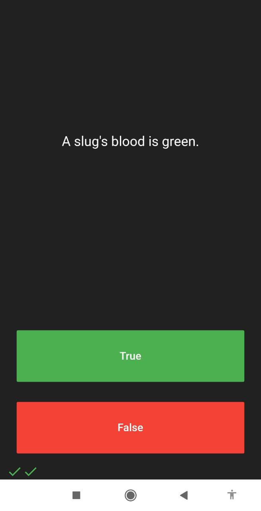
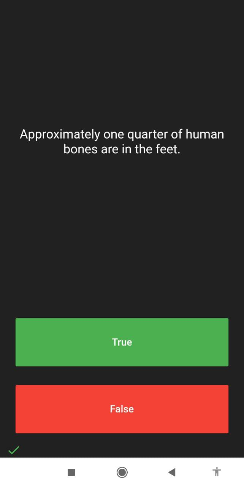

Flutter project

Quizzer

Android quiz application that tests your General Knowledege.There are a total of 15 questions,Each question will appear in center of screen, Corresponding option are provided
at bottom of screen in True or False Type. Once the user clicks on the option, user's answer will be shown below in tick if user was correct or cross form if user's selected option was wrong cannot be altered.

Objective

The main objective is to create an educational app that quizzes a user about their General Knowledge.

Features

The main feature of application is that along with the questions, answers will be show at the bottom of the screen so that user can keep the track of thier score and can move forward to next question instantly they finish their previous question along with their score.

Screenshots

    

